#AppStudio for ArcGIS - QT QML - Image Geolocator Tutorial

###Description

This tutorial shows how to use AppStudio for ArcGIS and QT Creator to make an app that reads the geotag of an image and display the location on a map.

No previous experience with either AppStudio for ArcGIS, QT Creator, or QML is necessary to follow this tutorial. However, it may be useful to be loosely familiar with the basics of each, in the event that error arise. 

It is expected that you have AppStudio for ArcGIS and QT Creator installed on your computer. instructions on how to do this can be found here: <https://doc.arcgis.com/en/appstudio/create-apps/installappstudio.htm>

This tutorial teaches how to do the following using qml and the arc QT sdk:

* Display images

* Read image exif tags

* Create a hamburger menu

* Create buttons

* Take text input

* Use a file dialog

  
#Instructions

###Step 1: Make A New App

The first step in making our app is to use AppStudio for ArcGIS to create a new app.

Open AppStudio for ArcGIS and double click "New App".  
You should be presented with a New App popup.  

We are going to use a starter template to do some of the hard work for us.  
Select "Starter" from the category list on the left side.

Next, select "Hello World (Runtime)" from the list of available templates.  
Enter a title for your app at the bottom of the popup window.  
Click OK.  
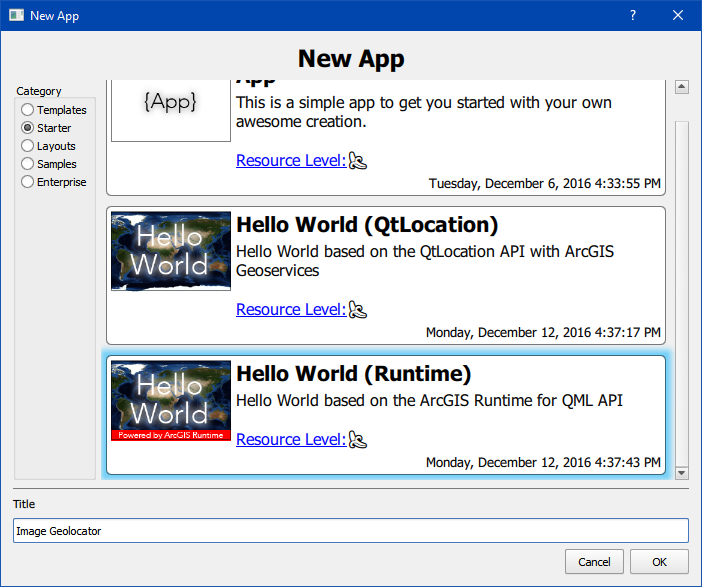

 
###Step 2: Open Your App in QT Creator

Now that we have created our app, we need to open it in QT Creator so we can edit it.

Click once on your app in AppStudio for ArcGIS.  
Now, click the green QT button in the tool bar at the top.  
After a moment, QT Creator should open with your app loaded. 

If you are new to QT Creator, take a moment to look around an see what different buttons do and what different files contain.  
When you are done, click the edit button on the left side and double click "HelloWorld.qml" in the navigation pane, just to the right of the edit button.  
This is where we will be working to make our app.
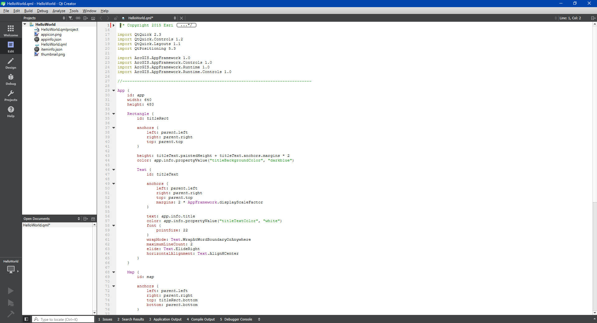

 
###Step 3: Editing the Existing Code

Before we add anything new we need to add to and change the existing code a bit.  

**First**, we need to import the modules we are going to use.  
If you look at the top of the script you should see 8 import statements that look like the following:

	import QtQuick 2.3
	import QtQuick.Controls 1.2
	import QtQuick.Layouts 1.1
	import QtPositioning 5.3
	
	import ArcGIS.AppFramework 1.0
	import ArcGIS.AppFramework.Controls 1.0
	import ArcGIS.AppFramework.Runtime 1.0
	import ArcGIS.AppFramework.Runtime.Controls 1.0

We are going to add 2 lines to this:

	import QtQuick.Controls 1.4
	import QtQuick.Dialogs 1.2

Your import block should now look something like this:
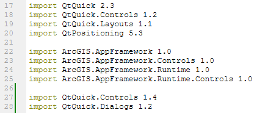

 
**Next**, we are going to change the default size of the app to put it in portrait layout.  
In the "App" deceleration change the properties "width" and "height" to 400 and 680 respectively.  
  

 
**Finally**, we need to change the size and placement of the map element.  
In the "Map" declaration find the "anchors" deceleration.  
Comment out or remove the "bottom" parameter.  

Now instead of telling the map element to stick to the bottom of its parent element (the "App" element), we are going to give it a set height.  
In the "Map" declaration put the following to set the height to half the parent element minus the title bars height (about half the screen):

	height: parent.height / 2 - titleRect.height

Your "Map" declaration should now look like this:
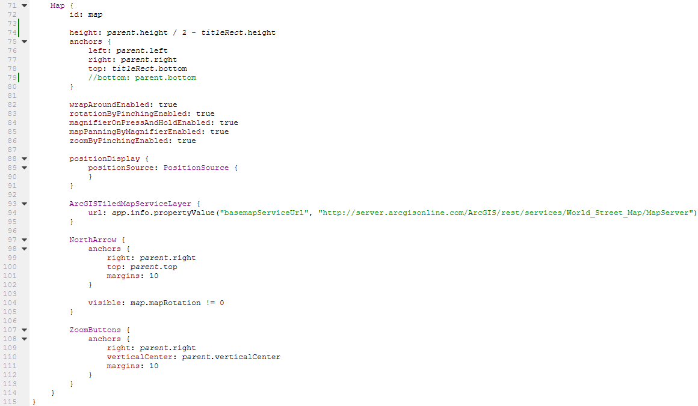

 
**Now**, run your app by going back to AppStudio for ArcGIS (it should still be open in the background),and click once on your app and hit the triangular run button in the top toolbar (you can also double click your app).  
It should look similar to the following:  
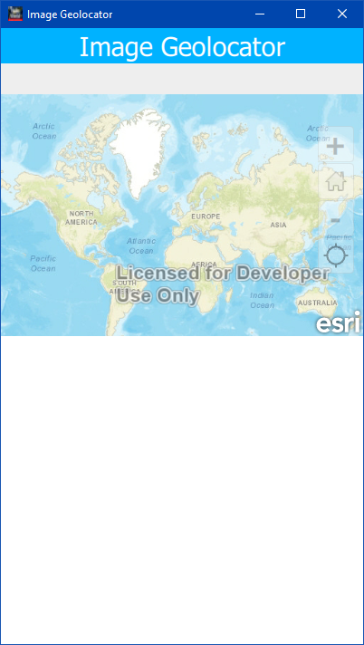

If you just get a small empty app, then some part of you code is wrong.  
Go back through what we have done and look for errors.

 
###Step 4: Create the Image Handlers

In the last step we emptied the bottom half of our app's screen.  
This was done to create a space for an image to be displayed.  
That way the user can see both the image and its location at the same time.

In order to display the image we need to add some elements in our code.

 
**First**, we are going to add an "ImageObject" element.  
This is an element from the ArcGIS AppFramework that allows for image manipulation.  
We are going to use it to store the images file location and get the images geotag if it has one.  
After the "Map" element's declaration (although it can go anywhere in the "App" declaration) add the following:

	ImageObject {
	        id: arc_image
	}

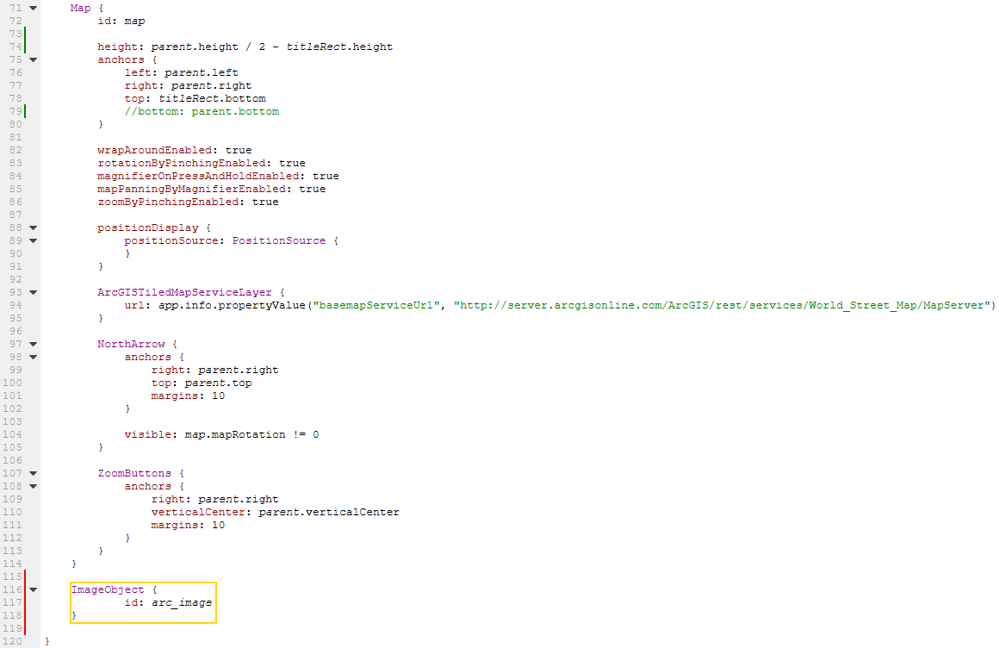

This simply creates the "ImageObject" element and gives it an id to call it by later.    
The id can be anything you like as long as it is one word (this goes for any element). Just remember that you need to refer to this element by this later

 
**Next**, we are going to create a "Rectangle" element for the image to go in.  
This is so we can change the background color that the image will sit on.
After our new "ImageObject" element's declaration, add the following:

	Rectangle {
        id: image_container
        color: "#000"				//sets the background color to black

        anchors {					//sets the position of the element to fill the empty space at the bottom of the screen
            left: parent.left
            top: map.bottom
            right: parent.right
            bottom: parent.bottom
        }
	}

 
**Finally**, we are going to add the element that will actually display our image.  
This is an "Image" element from QT Quick. It is a basic QT image element.  
Inside the "Rectangle" element declaration we just made (just place it after the anchors declaration), add the following:

	Image {
        id: image
        source: arc_image.url				//use the image stored in the "ImageObject" arc_image
        fillMode: Image.PreserveAspectFit	//don't strech the image

        anchors {							//fill the rectangle
            left: parent.left
            top: parent.top
            right: parent.right
            bottom: parent.bottom
        }
    }

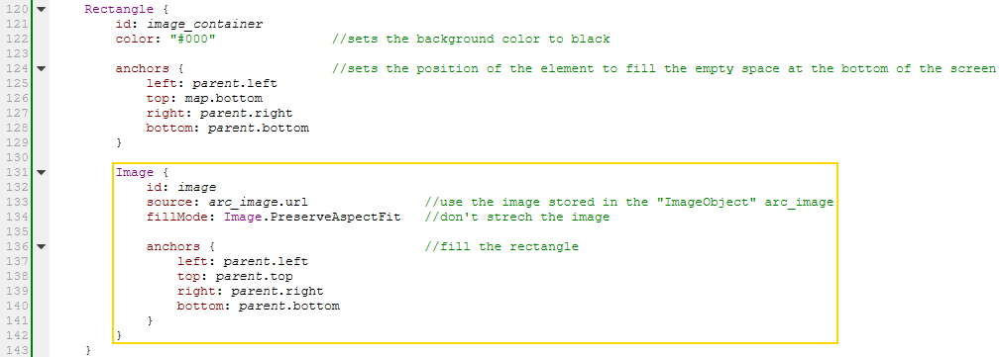

 
**Now**, run your app make sure everything is right.  
We have not given it an image to display yet, so it should look like this:  
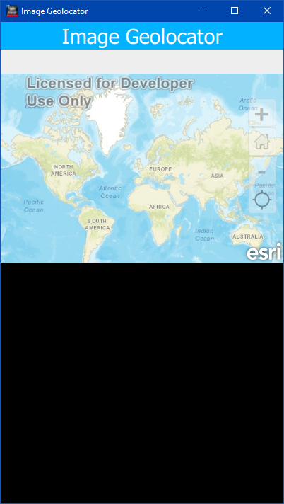

 
###Step 5: Create a Drop Down Menu

In mobile app development it is good practice to put buttons either on toolbars or in drop down menus.  
In this case we are going to use a drop down menu (you could make toolbar if you like, drop downs are just fun.).  
We are going to add it to the preexisting "Rectangle" element that is housing the app title.  

 
**First**, we are going to move the title over slightly to make room for our menu.  
Find the "Text" element with the id "titleText". It in near the top inside the "Rectangle" element with id "titleRect".  
Comment out or remove it's anchors' "right" property.  
Now give it a width property instead by adding the following in its declaration (not in the anchors):

	width: parent.width * 0.75

This makes the text element take up the left 3/4 of the "Rectangle" element.

The "Text" element's declaration should now look like this:  
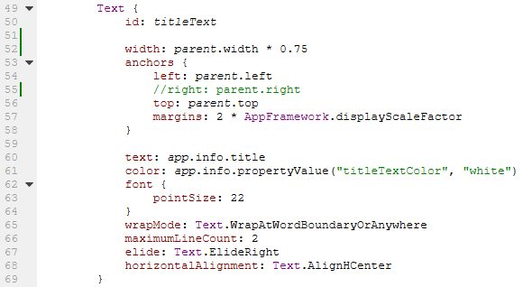

 
**Next**, we are going to add a "Button" element to use as the drop down menu.  
The "Button" element is from QTQuick Controls and is a clickable object that an action can be tied to.  
After the "Text" element we just edited add the following:

	Button {
	    id: menu
	    text: "MENU"			//test to be displayed on the button
	    menu: drop_menu			//declaring this is a menu and linking the "Menu" element with id "drop_menu"
	
	    height: parent.height	//set size to fill the rest of the "Rectangle" element
	    width: parent.height
	    anchors {
	        top: parent.top
	        right: parent.right
	    }
	}

The line "menu: drop_menu" is a reference to the "Menu" element we are about to create.  
This is just saying that when this button is clicked it should open that menu.

 
**Finally**, we are going to create a "Menu" element containing one "MenuItem".  
These are both from QTQuick Controls and are a basic way to create a simple menu.  
The "MenuItem" will be the button we use to start the process of opening an image.  
After the "Button" element we just made add the following:

	Menu {
        id: drop_menu

        MenuItem {									//button in the menu
            text: "Load Image"
            onTriggered: url_screen.visible = true	//action to be performed when the button is clicked
        }
    }

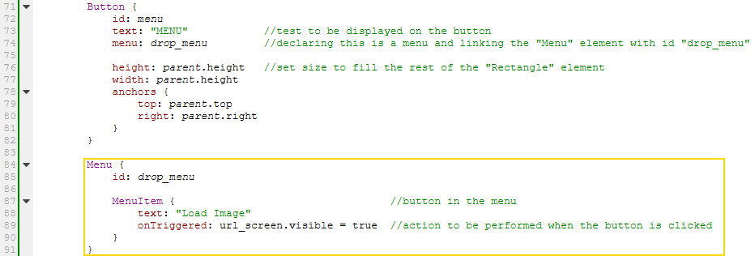

The "onTriggered" property has an action of making visible the popup screen we are going to make in the next step. 

**Now**, run your app.  
It should now look like this:  
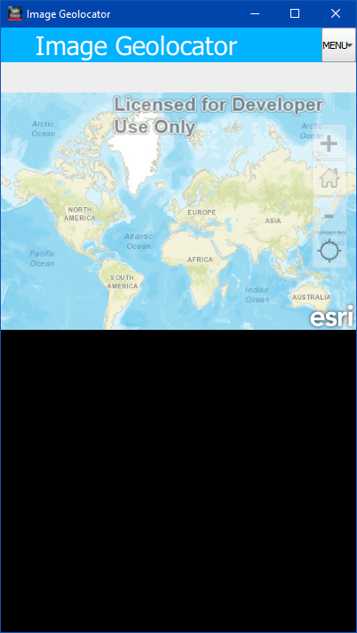

 
###Step 6: Create a Custom File Input Screen

This part is not strictly necessary, but we are going to build a custom screen for handling the file input operations.  
The reason it is optional is because we could just do it using only the built in file dialog (we will still use this as part of it), but it is a good thing to learn how to do.  
Beyond just doing this to learn how, you might use this if you were to add more ways to input an image file (or any other file you might want).  

 
**First**, we are going to make another "Rectangle" element.
This one is going to be invisible at first, though. That way we can make it visible when we need it by clicking the "MenuItem" we created in the last step.  

After our "Rectangle" element with id "image_container" add the following:

	Rectangle {
	    id: url_screen
	    color: "#000"				//set the background color to black
	    visible: false				//make it invisible at first
	
	    anchors {					//set it to take up the entire screen
	        left: parent.left
	        top: parent.top
	        right: parent.right
	        bottom: parent.bottom
	    }
	}

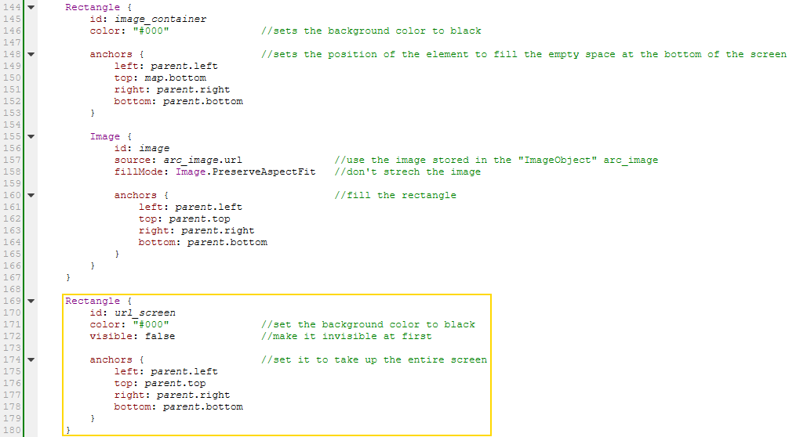

**Second**, we are going to add some text to tell the user what to do.  
Inside the "Rectangle" element we just made add the following:

	Text {
	    id: url_instructions
	    text: "Select an Image to Locate."		//text to be displayed
		
	    width: parent.width						//set it to be as wide as the parent "Rectangle" element
	    anchors {								//set it to be at the top with small margin of 10
	        left: parent.left
	        top: parent.top + 10
	    }
	    color: "#fff"							//set the text color to white
	    font {
	        pointSize: 20						//set the font size, this will determin the height
	    }
	    horizontalAlignment: Text.AlignHCenter	//center the alignment
	}

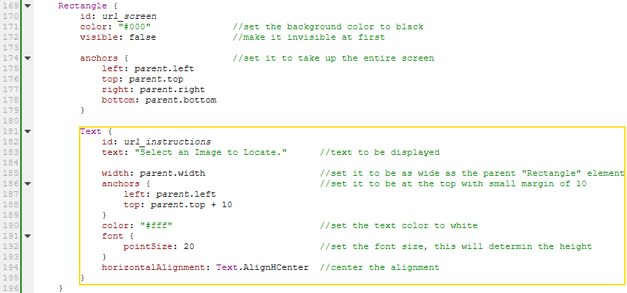

 
**Third**, we are going to use a "TextInput" element to give the user a way to manually enter the path to a file.  
The "TextInput" element is from QtQuick and is a basic one line text input box.  
Because of how basic this element is we are going to put it inside another "Rectangle" element so that it is visible.  
After the "Text" element we just added, and still inside our "Rectangle" element add the following:

	Rectangle {
        id: url_text_box
        color: "#444"						//set thebacground to a medium gray
		
        height: 50							//make it short, wide, and just under the instructions
        anchors {
            left: parent.left
            top: url_instructions.bottom
            right: url_browse.left			//leave room for a browse button
            margins: parent.width / 20
        }

        TextInput {
            id: url_text
            color: "#fff"					//mak the text color white
			
            anchors {						//fill the parent rectangle
                left: parent.left
                top: parent.top
                right: parent.right
                bottom: parent.bottom
                margins: 2.5
            }
            font.pointSize: 20				//set the height using font size
            clip: true						//if it overflows, don't show it
        }
    }

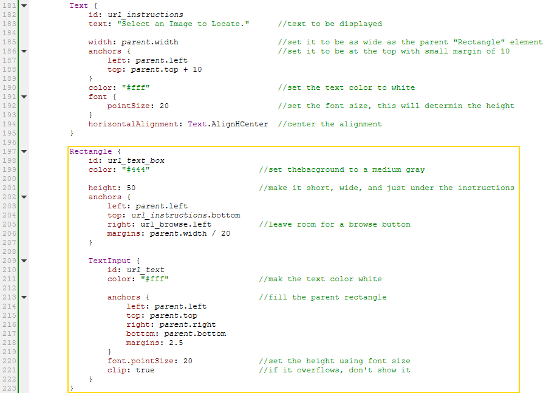

 
**Fourth**, we need to add the browse button that was just referenced in that last "Rectangle" element we added.  
After the "Rectangle" element we just added, add the following:

	Button {
        id: url_browse
        text: "Browse"					//text that will be displayed on the button
		
        width: parent.width / 10		//set it to be 1/10 the width of the screen and the same height as the "TextInput" element
        anchors {
            top: url_text_box.top
            right: parent.right
            bottom: url_text_box.bottom
            margins: 5
        }

        onClicked: file_dialog.open()	//when clicked open the file dialog
    }

We will add the file dialog, that this button opens, in the next step.  

 
**Fifth**, we are going to add an ok button.  
In the next step we will define its action so that it gets the image that has been selected and closes the input screen we are creating now.  
After the browse button we just made, add the following:

    Button {
        id: url_ok
        text: "ok"						//text that will be displayed
		
        anchors {						//but it on one side on the bootom of the screen
            left: parent.left
            bottom: parent.bottom
            margins: parent.width / 4
        }
        action: load_image				//do this sction that is defined elsewhere
    }

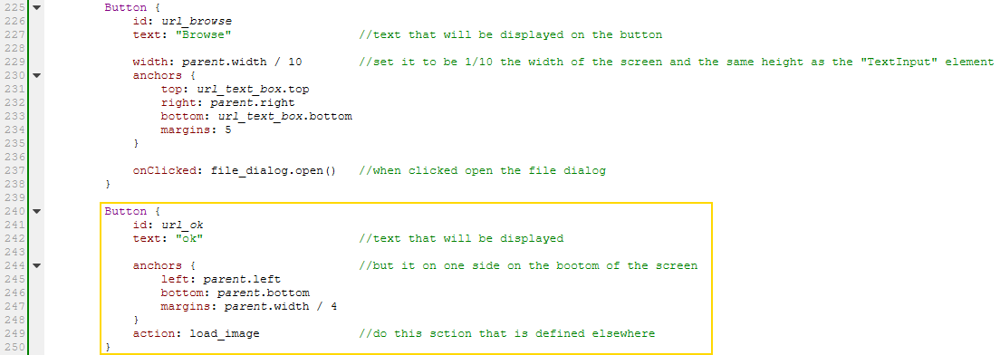

 
**Finally**, we are going to add a cancel button.  
It will just make the input screen invisible again.  
After the ok button, add the following:

    Button {
        id: url_cancel
        text: "cancel"					//text that will be displayed
		
        anchors {						//put it opposite the ok button
            right: parent.right
            bottom: parent.bottom
            margins: parent.width / 4
        }
        onClicked: url_screen.visible = false	//make the url_screen invisisble again when clicked
    }

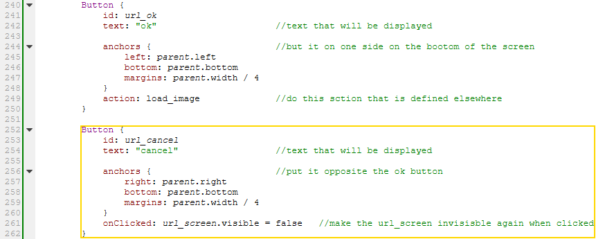

 
**Now**, run your app, once again.  
It should not look any different, but your menu button should now work.  
Click the menu and click "Load Image".  
You should see the input screen we just created.  
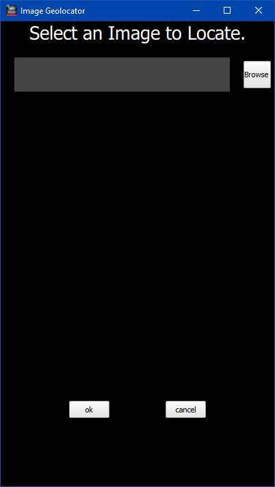

The only button that will work is cancel, but we are going to fix this in the next step.

 
###Step 7: Making Everything Work

All the visible parts of our app are in place, now we just need to add the behind the scenes pieces that make everything work.  

 
**First**, we are going to make our browse button work by making a "FileDialog" element.  
This is from QtQuick Dialogs and is a way to work with the devices default file dialog.  
After the url_screen "Rectangle" element's declaration add the  following:

    FileDialog{
        id: file_dialog
        nameFilters: [ "Image files (*.jpg *.png)", "All files (*)" ] 	//guide the user to select an image file
        onAccepted: {													//when they hit ok place the path to the file in the "TextInput" so we can add it to the "ImageObject"
            url_text.text = fileUrl
            url_text.remove(0,8)										//remove file:/// prefix
        }
    }

We are having the "FileDialog" element dump it contents in the "TextInput" (after removing a prefix) so that we don't end up with 2 paths when the user hits ok.  

 
**Next**, we are going to add the "Action" element that is run when the ok button is clicked.  
This is from QtQuick Controls and is similar to a function in other languages, but specifically for "triggered" events.  
This action will get the path from the "TextInput", load the image into the "ImageObject" (which will pass the image path to the "Image" element for display), get the images geotag (if it has one) , and pan and zoom the map the the images location.  
After the "FileDialog" element we just made, add the following:

	Action {
        id: load_image
        onTriggered: {											//when the ok button is clicked
            url_screen.visible = false							//make the url_screen invisible
            arc_image.load(url_text.text)						//load the image into the "ImageObject"
            position.x = arc_image.exifInfo.gpsLongitude		//get the longitude from the images exif tag, and add it to the point "position"
            position.y = arc_image.exifInfo.gpsLatitude			//get the latitude from the images exif tag, and add it to the point "position"
            map.zoomToResolution(1.5)							//zoom the map
            map.panTo(position.project(map.spatialReference))	//pan the map to the image location
        }
    }

 
**Finally**, we need to make the "Point" element that is referenced as "position" in the "Action" element we just made.  
The "Point" element is from ArcGIS AppFramework Runtime, and is just a subset of the "Geography" element tag. It simply defines a geographic point.  
After the "Action" element we just made, add the following:

    Point {
        id: position
        spatialReference: SpatialReference {wkid:4326}	//gps uses this spatial reference so that's what phones use, and that is what we have to use
    }

 
###Congratulations!
If you have followed this tutorial correctly, you should now have a fully functioning image geolocator app.  
Try running your app and selecting an image with a geotag.  
It should locate the image for you and display the image itself below the map.  

If something is not working try looking at the complete "HelloWorld.qml" file, located in this repository.  